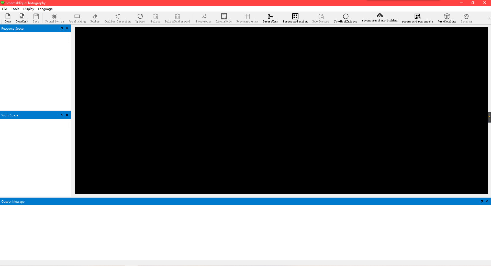
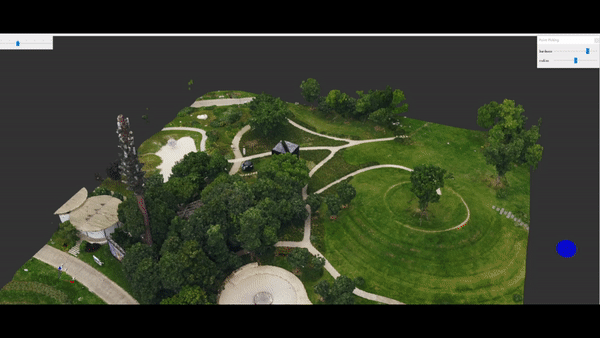
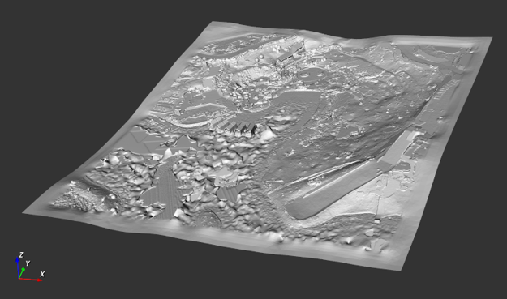
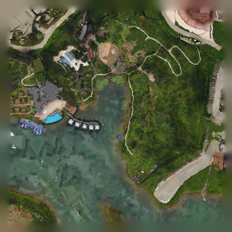

# Smart Oblique Photography
Smart Oblique Photography 是一个点云网格模型的交互编辑系统。

## Background
针对整个城市建模的任务，倾斜摄影是一种常用的技术。倾斜摄影技术利用无人机航拍，对城市场景从多个角度拍摄大量的图像数据，然后从图像数据重建出三维模型和纹理。   
**由倾斜摄影技术直接得到的模型存在以下问题：**
1. 模型和贴图数据量巨大，但是模型存在错误部分（噪声、水面）
2. 模型性价比低（对于单一结构的物体使用过多三角面）
3. 模型网格不具有单体意义，难以进行后续的编辑
4. 纹理受无人机航拍时光照情况的影响，不能直接使用

**针对模型需要做的处理：**
1. 单体化模型
2. 修复模型中的错误部分
3. 减少模型数据量

**现行人工方案：**  
美工使用网格处理的商业软件，将倾斜摄影模型格式转换成通用网格格式，简化网格；手动切割，实现单体化；修改网格错误部分。

**现行人工方案存在问题：**  
操作复杂导致效率低下，不适合大规模应用，人工成本高，也不利于公司发展。

**现行人工方案存在问题的解决方案：**  
考虑倾斜摄影模型结合手工建模的方式，对于精度要求不高但是比例要求较高的地形模型通过倾斜摄影模型获得；对于精度较高的同时容易单体化的建筑使用手动建模。

## Demand
智慧城市相关应用的需求是**尽量真实复刻**现实世界，考虑使用部分航拍模型结合手工建模，对于精度较高的建筑仍手动精细建模，而精度要求不高但比例要求较高的**地形**则通过倾斜摄影模型获取。

## Solution
&emsp;&emsp;我们发现地形的几何质量要求不高，但需要很高的纹理质量。在对网格编辑时未必需要同时考虑纹理信息，并且对于网格的操作比较繁琐，需要考虑各种拓扑关系，所以尝试将几何和纹理信息解耦。 
&emsp;&emsp;在进入编辑前先在网格模型上每面片根据泊松盘采样获得一定密度的**模型点云**，后面的提取，分离，删除等操作都对点云进行处理，能加快开发速度和运行效率。 
&emsp;&emsp;而对于没有显式指定模型意义的点集，我们发现有意义的整体往往在空间上相邻(例如汽车外壳和其车轮)，且其宏观上满足一些特征。所以其提取和分离我们通过**区域生长**算法，引入**颜色复杂度**，**法线复杂度**，**平面度**等特征，从用户选取的部分点开始，快速扩展到相似的点集，该部分通过场景八叉树加速位置查询。 
&emsp;&emsp;同时对于算法少选或误选的部分点，我们使用**离群点检测**和去除算法来保证选取的有效性。 
&emsp;&emsp;但因为倾斜摄影模型只有最近表面信息，编辑删除部分杂物后将会产生空洞，为了简易填补模型空洞，我们通过顺序无关的**样式纹理合成**结合凹凸贴图思想，来生成纹理点云填补空洞。 
&emsp;&emsp;在保留需要的部分，删除无意义部分后，就需要重建模型几何和纹理还原为网格加贴图。 
&emsp;&emsp;通过**泊松网格重建**可以将点云重建回网格模型，但重建结果往往包含很多低频面片，我们使用**边坍塌网格简化**算法保留细节降低面数，并**去除非流形**点及面清理模型为后面计算做准备。 
&emsp;&emsp;此时的网格模型没有纹理坐标，再通过**图特矩阵网格参数化**，将网格面片无重叠且尽量小扭曲地投影到UV空间来获得纹理坐标(展UV)，最后通过**光线投射烘焙纹理**，采样原有模型的光照贴图到当前模型纹理空间，最终获得了有意义且可编辑的地形模型。 
&emsp;&emsp;因为地形块通过规定坐标范围划分，部分模型会跨越地形块，编辑后可能存在地块接缝对端问题，我们通过**网格缝合**算法来将分隔平面两边未对端的网格重新拓扑分配面片，得到了无接缝的多地形块。 
&emsp;&emsp;后续可以通过附上法线贴图和置换贴图来丰富地形细节，暂未实现的有：1. 光照贴图去光照(Delighting)得到更有意义的材质。2. 粗糙建筑的程序化生成。3. 更有效的批处理算法。 

## Modules
### GUI
  

## Examples
### 交互选取
  
  

### 空洞填补
  
  

### 网格参数化
  
  

### 纹理烘焙
  

